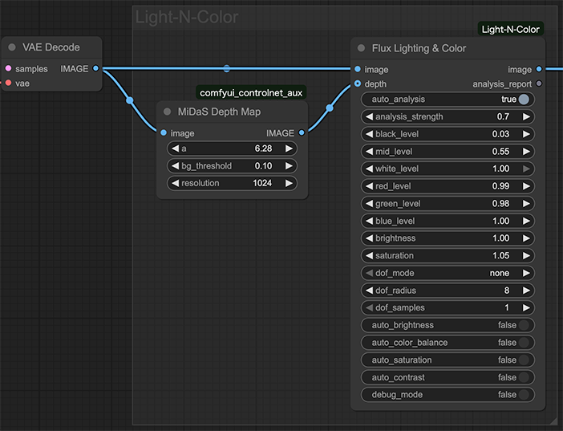
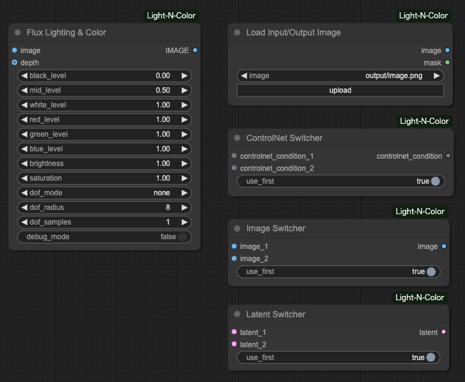

<h1>ComfyUI-Light-N-Color</h1>

A collection of utility nodes for ComfyUI that enhance your image generation workflow. This extension provides tools for image processing, file management, and workflow control.

<h2>Features</h2>

<h3>Image Processing</h3>
<ul>
  <li><strong>Flux Lighting & Color</strong>: Advanced image processing node that allows you to:
    <ul>
      <li>Adjust brightness, contrast, and saturation</li>
      <li>Fine-tune RGB channel levels individually</li>
      <li>Apply depth of field effects with various blur types</li>
      <li>Control black, mid, and white levels for perfect tonal balance</li>
    </ul>
  </li>
</ul>

<h3>File Management</h3>
<ul>
  <li><strong>Load Input/Output Image</strong>: Enhanced image loader that:
    <ul>
      <li>Loads images from both input AND output directories</li>
      <li>Supports browsing through subdirectories</li>
      <li>Preserves directory structure during selection</li>
    </ul>
  </li>
</ul>

<h3>Workflow Control</h3>
<ul>
  <li><strong>Switcher Nodes</strong>: A set of utility nodes to control your workflow:
    <ul>
      <li><strong>ControlNet Switcher</strong>: Toggle between two ControlNet conditions</li>
      <li><strong>Image Switcher</strong>: Switch between two image inputs</li>
      <li><strong>Latent Switcher</strong>: Choose between two latent representations</li>
    </ul>
  </li>
</ul>

<h2>Installation</h2>

<ol>
  <li>
    
Clone this repository into your ComfyUI custom_nodes directory:

    <pre><code>cd ComfyUI/custom_nodes
git clone https://github.com/yourusername/ComfyUI-Light-N-Color.git</code></pre>
  </li>
  <li>
Restart ComfyUI
</li>
</ol>

<h2>Requirements</h2>

<ul>
  <li>ComfyUI</li>
  <li>Python packages: numpy, torch, opencv-python, pillow</li>
</ul>

<h2>License</h2>

This extension is provided as-is, with no restrictions on use or modification. Feel free to adapt it to your needs.

Happy creating! Peace :)

<h2>Update</h2>

2025/08/04

Added auto_analysis mode that automatically adjusts the color and contrast to your own settings.

